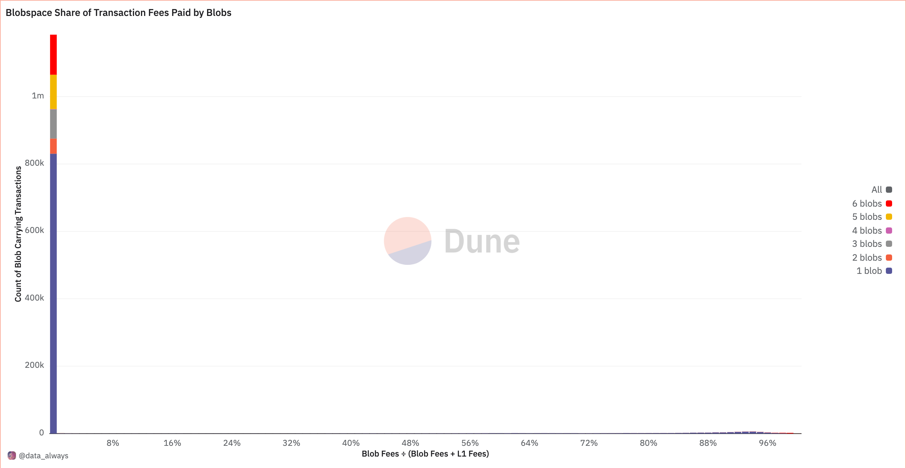
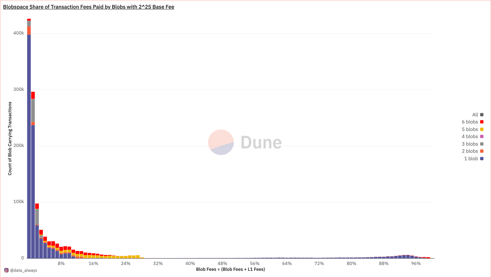

## Abstract

This EIP proposes an increase to the MIN_BASE_FEE_PER_BLOB_GAS to speed up price discovery on blob space. 

## Motivation

When scoping 4844, the thinking was that blobs would only enter price discovery once, relatively quickly after the blob rollout; however, this has not been the case. In fact, blobs have entered price discovery several times, and the frequency of price discovery events is likely to increase in the short term as we approach saturation of capacity. Moreover, the roadmap calls for further increases in blob capacity in subsequent hardforks, which may lead to price discovery events happening around those changes in the future. 

Increasing the MIN_BASE_FEE_PER_BLOB_GAS will speed up price discovery on blob space.

## Specification

The only specification change introduced by this EIP is setting MIN_BASE_FEE_PER_BLOB_GAS to 2**25:

```diff
+ MIN_BASE_FEE_PER_BLOB_GAS  =  2**25
- MIN_BASE_FEE_PER_BLOB_GAS = 1
```

## Rationale

The current MIN_BASE_FEE_PER_BLOB_GAS is 1 wei. This is many orders of magnitude lower than the prevailing price of blobs when blobs enter price discovery. Whenever demand for blobs exceeds supply, blobs enter price discovery, but traversing the 8 orders of magnitude between 1 wei and the point where elasticity of demand starts to decrease takes a long time.

The blob base fee can at most double every $\log_{1.125}(10) = 5.885$ blocks when blocks use all available blob space. When blobs enter price discovery, they must climb many factors of 2 to reach the prevailing price.

To set the parameter apropriately, one aproach is to look at the cost of simple transfers when base fees are low. The cost of a simple transfer when the base fee is 1 GWEI  is ~5 cents USD at today's prices (2,445.77$ ETH/USDC). We can try to peg the minimum price of a blob to that. Today, to reach this price, it requires an excess blob gas of `63070646`. When you calculate how long this would take to reach from 0 excess blob gas, you get:

```
63070646/(3 * 2**17) = 160.396947225
```

The closest power of 2 to the corresponding reserve price would be `MIN_BASE_FEE_PER_BLOB_GAS = 2**27`. Out of an abundance of caution, we will go with `MIN_BASE_FEE_PER_BLOB_GAS = 2**25` to ensure that even if the price of ETH rises significantly, the reserve price will not be set too high. This value corresponds to a minimum blob price of ~1 cent at today's prices (2,445.77$ ETH/USDC). Further, decreasing the `MIN_BASE_FEE_PER_BLOB_GAS` beyond `2**25` would slow down price discovery without a significant decrease in the price of blobs when the network is unsaturated. 

Below you will find a plot provided by @dataalways showing the fraction of type 3 transaction fees that are paid in blob base fees for different values of `MIN_BASE_FEE_PER_BLOB_GAS`. Note that even after the proposed change, for historical values of l1 gas, the price of blobs would have been dominated by the price of the L1 gas.  



<div style="page-break-after: always;"></div>



<div style="page-break-after: always;"></div>

---


## Backwards Compatibility

This EIP is not backwards compatible and requires a coordinated upgrade across all clients at a specific block number.

## Security Considerations

Rollups that use blobs as a data availability layer will need to update their posting strategies. 

## Copyright

Copyright and related rights waived via [CC0](https://creativecommons.org/publicdomain/zero/1.0/).
